# bm-x-site-doc关于建站的流程简单说明

## *建站部件*

```
x-site-server
x-site-client
x-site-opapi  openapi相当于给别人使用的一个sdk，内部基本是调用的server的接口（server调service层调dao层）
x-site-roach
x-site-render
x-site-tpl-dev 是开发模板需要依赖的包
x-site-tpl-manager  管理模板的工程
x-site-ui 基础的ui包
x-site-kit  
x-site-common
x-site-service  dao
```

## *大致说明*

```
1. x-site-server + x-site-client + x-site-openapi是看到的可以编辑的页面
2. 点击发布，利用小强x-site-roach将编辑的组件组合成html存放到了aliyun
3. 各个业务线调用x-site提供的接口，到aliyun的oss上获取html页面
4. x-site-kit  x-site-common  x-site-service  dao  是一些基础的依赖包
```


## *问题说明*

#### 1、模板 x-site-ui-home
window.xSiteIntegrate  此对象

__XSite_widgetInject

模板的组件分为  qmBar     qmGroup


#### 2、主要信息存放位置

用户编辑的模板对应的数据在库里pageinfos

对应的生成的文件位置在：http://bm-oss.oss-cn-hangzhou.aliyuncs.com/x-site/test/public/barRepo/x-site-ui-ehome，x-site-ui-ehome：代表每个业务线的工程名字

[查看某个用户编辑的内容](https://github.com/yclxiao/bm-x-site-doc/blob/master/pageinfos.json)


#### 3、[这段js作用](https://bm-oss.oss-cn-hangzhou.aliyuncs.com/x-site/test/public/buildTemplate/ehome-index-demo3.js)

```
https://bm-oss.oss-cn-hangzhou.aliyuncs.com/x-site/test/public/buildTemplate/ehome-index-demo3.js
```

+ 可能编辑页，加载此js，然后利用用户存储的编辑数据，进行渲染

+ 也可能这js无用，利用的库里存储的用户数据表的组件，再利用数据，然后渲染出页面
	

#### 4、x-site-server  的 这个url  /mysite/pc/index/1505979404711  做了啥？
+ 获取/xsite-bin/page-svc/getDetailPageInfo?platform=pc&pageType=index&pageCode=1505979404711&sc=这个链接，获取页面信息

+ x-site-web-client，这个工程中的代码
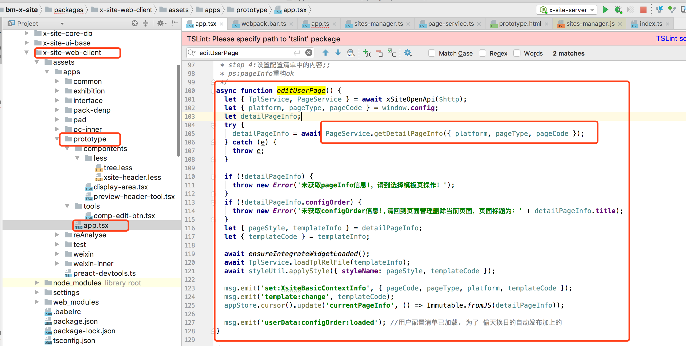

#### 5、看看这里做了啥/Users/yclxiao/Project/bm-x-site/packages/x-site-web-client/assets/apps/prototype  的js渲染的啥？再看看这个编辑页面怎么把模板渲染出来的？
+ 主要是这个组件有效：
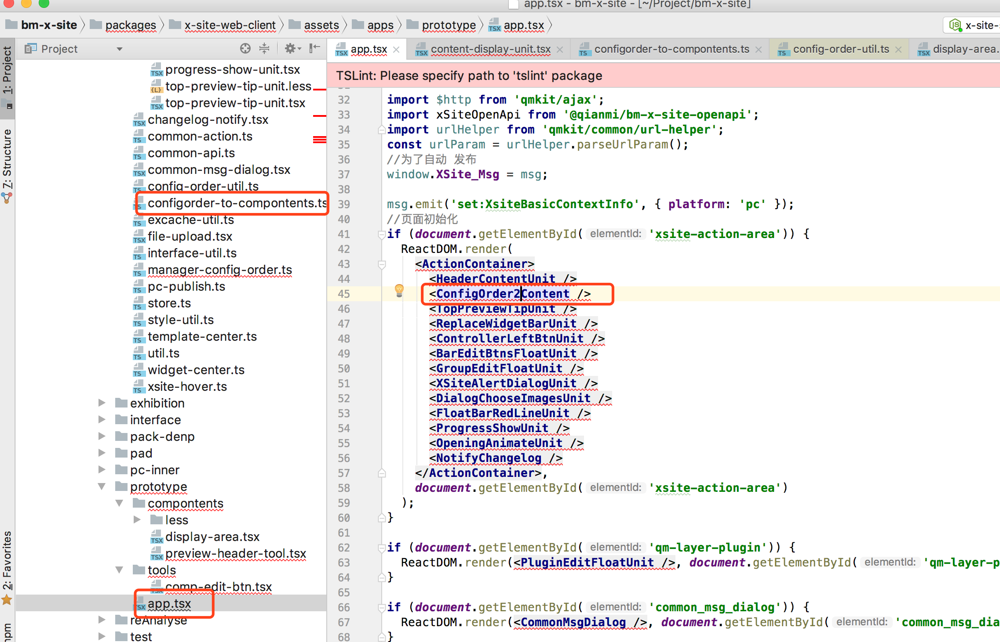

+ 在根据bm-x-site-core中的此方法，根据配置清单生成了组件树。利用react 提供的React.createElement方法http://www.onmpw.com/tm/xwzj/web_103.html
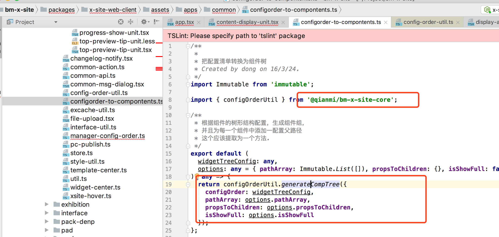

+ 再看看pageservice.getDetailPageInfo做了啥？怎么取的库里数据，怎么出来是乱码？
调用接口，从pageinfos表里取出数据，然后将所有信息转成了乱码，输出到前端，到了前端再将所有信息的乱码转为正常字符
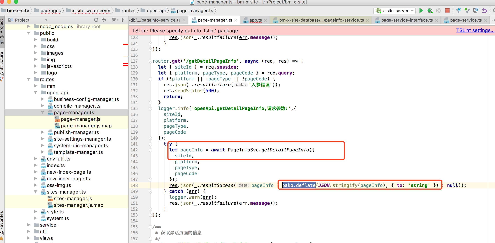
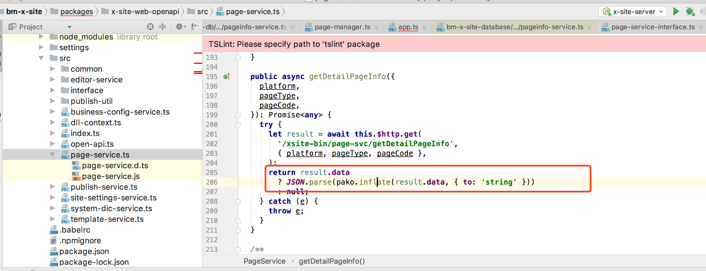


#### 6、发布时，保存哪些东西？到了小强之后，小强怎么组装页面。
+ 此处执行了发布
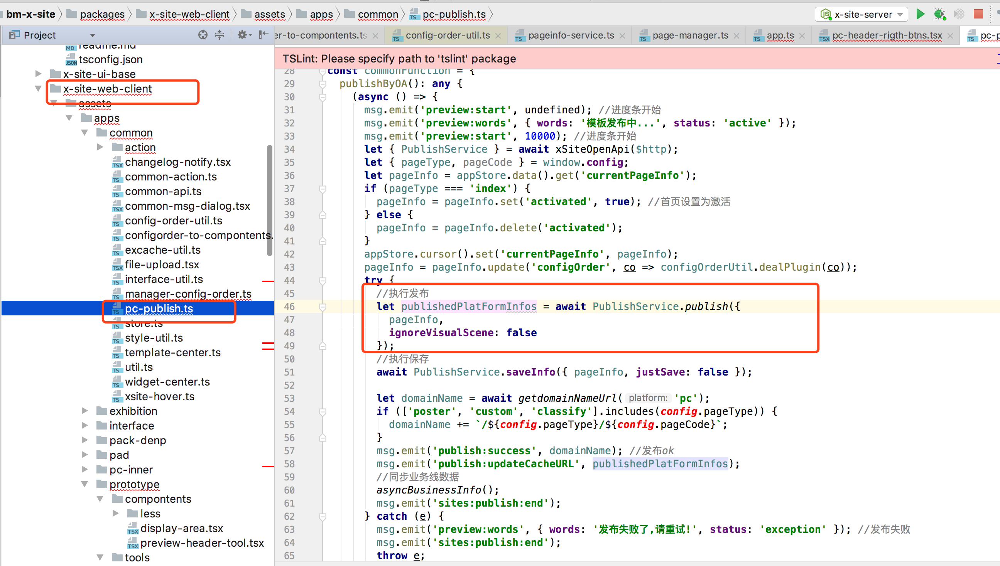

+ 还利用
compileOther.commonPageParams = PublishHelp.generateCommonPageParams({ configOrder, loadingConfigOrder });生成common页，此方法实则也是调用的ReactDOMServer.renderToStaticMarkup进行页面渲染的

+ 利用这个渲染首页   ReactDOMServer.renderToStaticMarkup(co2Components(indexConfig2Render))，
    根据博客http://blog.csdn.net/u013063153/article/details/52488879以及官网介绍  ReactDOMServer 这个方法可以在客户端使用，直接将react的组件转为html字符串
    
+ 把组件翻译成html字符串之后，再调用了x-site-server的/xsite-bin/compile-svc/compile请求，向redis发出了任务，通知了小强。
    然后/xsite-bin/compile-svc/verifyCompileBatch用来获取编译的结果（以下截图是代码说明）
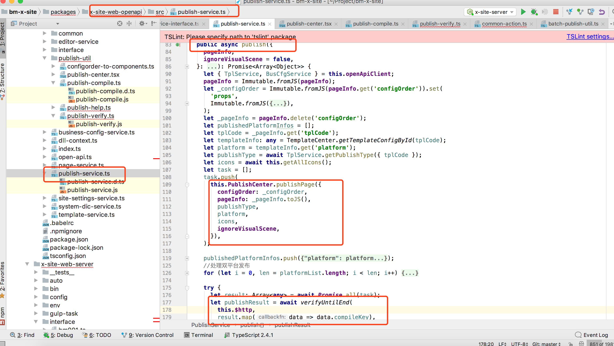 

+  在页面中出现的 openapi的js，实则是调用的阿里云上的openapi   js。打断点调试的时候要注意 
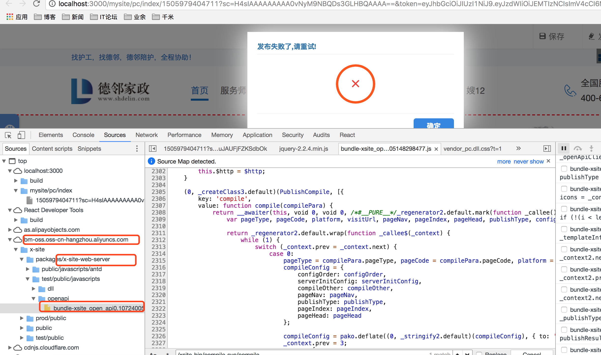

+ 在x-site-server中发起了/compile请求，然后丢任务到redis，再通知小强，把任务的key丢给了小强   


#### 7、小强是如何获取任务，渲染页面的？
+ ********建站所谓的使用Node进行服务端渲染页面（其实包括几个方面：1、服务端执行js的能力，比如js打包，服务端渲染页面，服务端拼装html），主要就是小强这里使用的。至于ReactDomServer.renderToString 此方法可以在客户端执行（直接生成html字符串，不是必须在服务端执行）
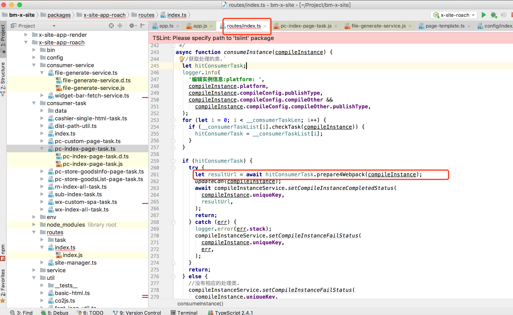
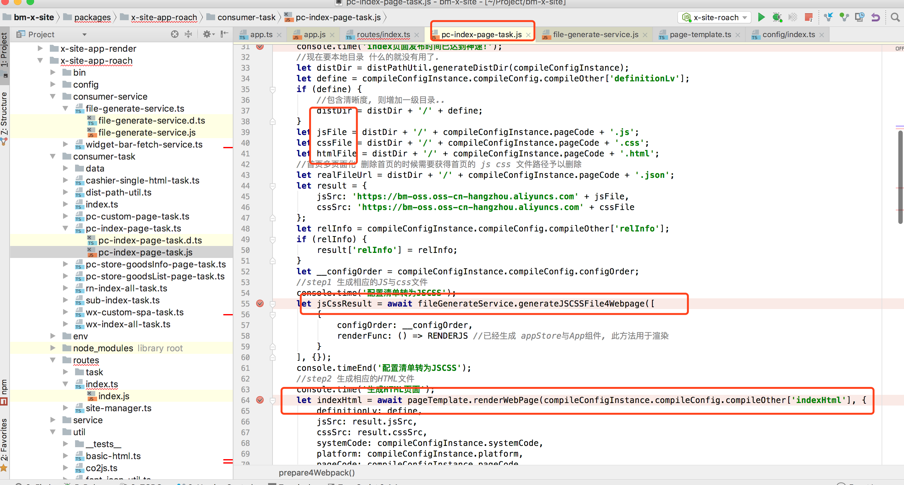
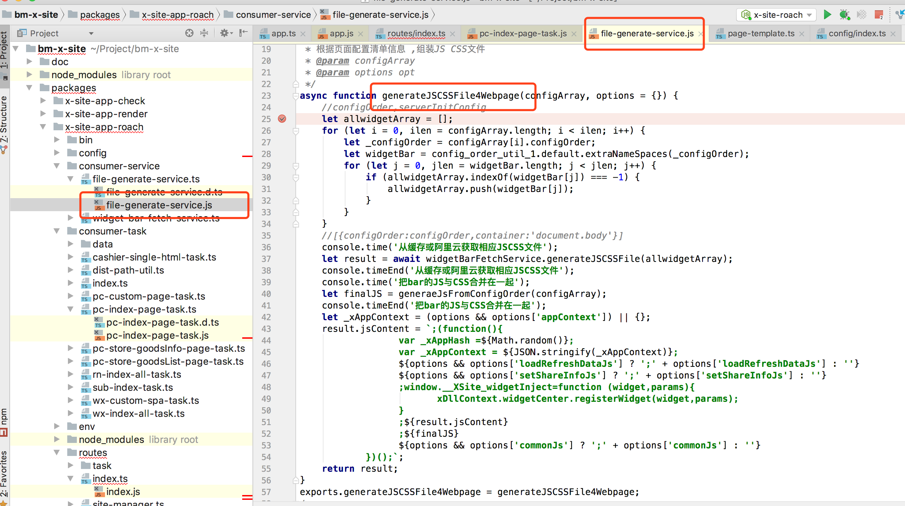
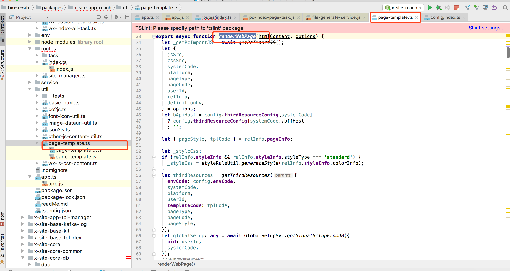

 + 以上截图是几个关键的步骤：
 	
 	let resultUrl = await hitConsumerTask.prepare4Webpack(compileInstance); 这里就是利用配置的数据 打出编辑页面的js  以及 拼装整个页面的Html
 	
+ 这里有4个关键的步骤：
    * ①、确定编辑页面打包出来的js  css  以及最终html的文件路径（阿里云上）
    * ②、根据编辑的页面打包出对应的js（此处将编辑页面的各个组件的js全部打到一起（此js里包含  建站模板的数据+用户配置的数据），以及css也打到一起）
    * ③、根据编辑页面的js以及其他信息组装出最终的html，最终的html主要内容就是此js  https://bm-oss.oss-cn-hangzhou.aliyuncs.com/x-site/test/ehome/D1234/view/pc/index/LD/1505979404711.js，此js种的几处关键代码：
    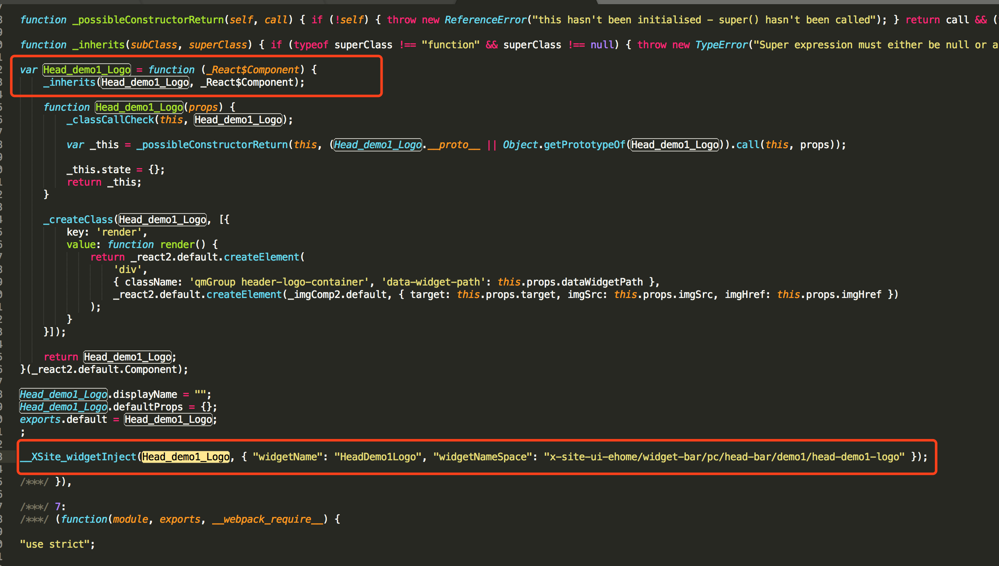
    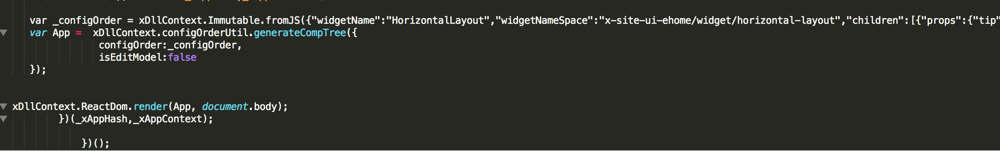
    
这个js的内容是由原始的模板 以及 用户的配置数据组成，
 
```
var App =  xDllContext.configOrderUtil.generateCompTree({
               configOrder:_configOrder,
               isEditModel:false
   });//这段代码渲染返回了react的组件数，
```

```
xDllContext.ReactDom.render(App, document.body);
		        })(_xAppHash,_xAppContext);
              
      })();这段代码将react组件树渲染到页面上
```


__XSite_widgetInject这个代码啥意思？？

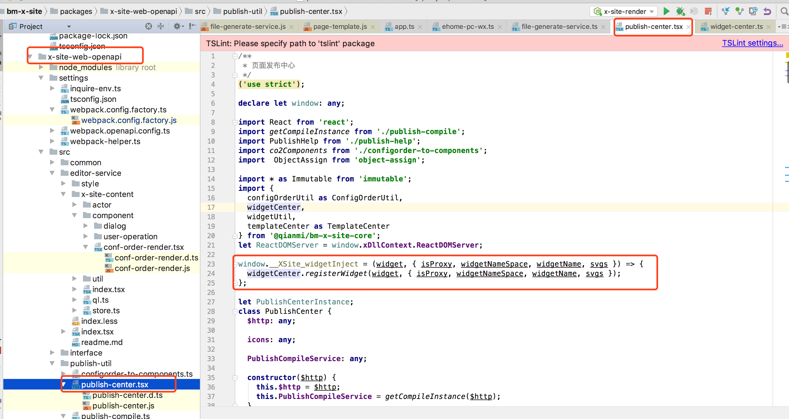

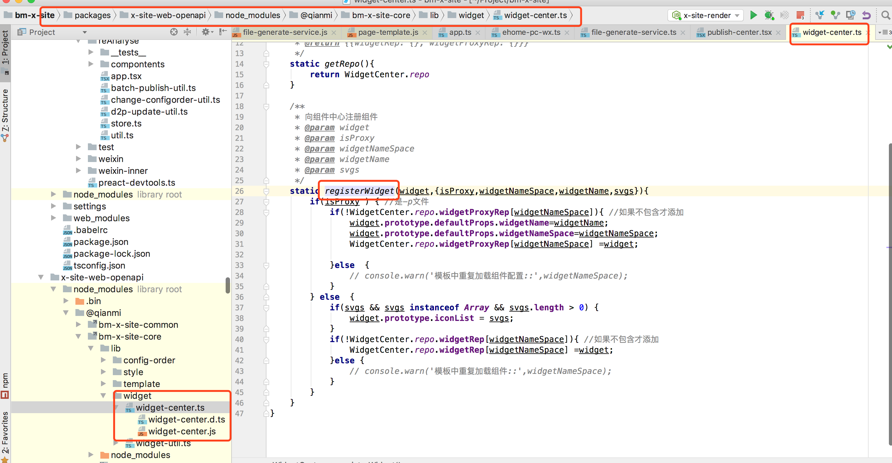

```
//注册组件到组件中心
window.__XSite_widgetInject = function (widget, _a) {
    var isProxy = _a.isProxy,
        widgetNameSpace = _a.widgetNameSpace,
        widgetName = _a.widgetName,
        svgs = _a.svgs;
    widgetCenter.registerWidget(widget, { isProxy: isProxy, widgetNameSpace: widgetNameSpace, widgetName: widgetName, svgs: svgs });
};
```


```
/**
 * 组件注册管理中心 只管组件逻辑 , 不管其他
 */
var WidgetCenter = /** @class */function () {
    function WidgetCenter() {}
    /**
     * 获取组件仓库
     * @return {{widgetRep: {}, widgetProxyRep: {}}}
     */
    WidgetCenter.getRepo = function () {
        return WidgetCenter.repo;
    };
    /**
     * 向组件中心注册组件
     * @param widget
     * @param isProxy
     * @param widgetNameSpace
     * @param widgetName
     * @param svgs
     */
    WidgetCenter.registerWidget = function (widget, _a) {
        var isProxy = _a.isProxy,
            widgetNameSpace = _a.widgetNameSpace,
            widgetName = _a.widgetName,
            svgs = _a.svgs;
        if (isProxy) {
            if (!WidgetCenter.repo.widgetProxyRep[widgetNameSpace]) {
                widget.prototype.defaultProps.widgetName = widgetName;
                widget.prototype.defaultProps.widgetNameSpace = widgetNameSpace;
                WidgetCenter.repo.widgetProxyRep[widgetNameSpace] = widget;
            } else {
                // console.warn('模板中重复加载组件配置::',widgetNameSpace);
            }
        } else {
            if (svgs && svgs instanceof Array && svgs.length > 0) {
                widget.prototype.iconList = svgs;
            }
            if (!WidgetCenter.repo.widgetRep[widgetNameSpace]) {
                WidgetCenter.repo.widgetRep[widgetNameSpace] = widget;
            } else {
                // console.warn('模板中重复加载组件::',widgetNameSpace);
            }
        }
    };
    WidgetCenter.repo = {
        widgetRep: {},
        widgetProxyRep: {}
    };
    return WidgetCenter;
}();
```


xDllContext.configOrderUtil.generateCompTree 这段代码怎么返回组件树的？？
        
        利用react提供的api：React.createElement( type, [props], [...children])


   * ④、将文件上传的阿里云上
    	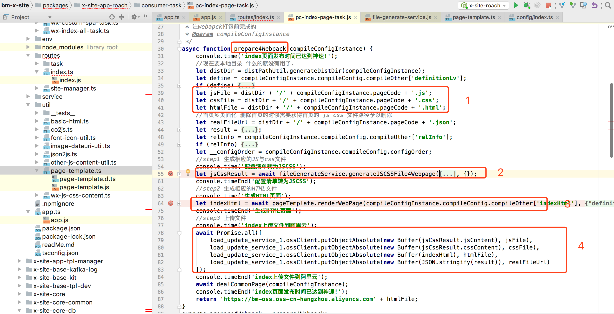
    	

#### 8、html放在哪个路径，render怎么取页面
	http://localhost:3001/ehome/D1234/pc/index   本地启动render，获取用户的页面

#### 9、window下挂载了哪些对象？什么部件往window里挂对象了？
	没看了。。。


